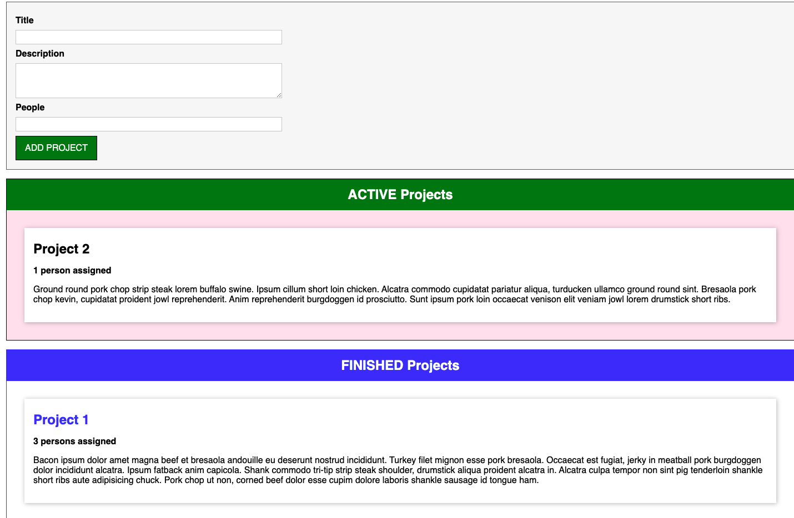

# Drag-Drop-Project-Management

## Table of Contents

* [Purpose](#Purpose)

* [Technologies](#Technologies)

* [Installation](#Installation)

* [Contact](#Contact)

* [License](#License)

## Purpose

A project made with Typescript to allow users to keep track of active projects and once completed the ability to drag them over to "Finished Projects" and also vise-versa. The user has the abilty to create: Title, Description and also how many person(s) are working on the project.

## Technologies

* ***Nodejs***
* ***TypeScript***
* ***BootStrap*** 
* ***Webpack***
* ***CSS***
* ***HTML***

## Installation

1. Clone the repository on a local machine.
2. Open the apps directory and run a `npm install` to get all dependencies.
3. In the command line run `npm start` to get the server up and running. 

## Contact

* [Email](mailto:josephjlyons90@gmail.com)
* [LinkedIn](www.linkedin.com/in/joseph-lyons-0a2630200/)

## License

Copyright (c) [2021] [Joseph Lyons]
Permission is hereby granted, free of charge, to any person obtaining a copy of this software and associated documentation files (the "Software"), to deal in the Software without restriction, including without limitation the rights to use, copy, modify, merge, publish, distribute, sublicense, and/or sell copies of the Software, and to permit persons to whom the Software is furnished to do so, subject to the following conditions:

The above copyright notice and this permission notice shall be included in all copies or substantial portions of the Software.
